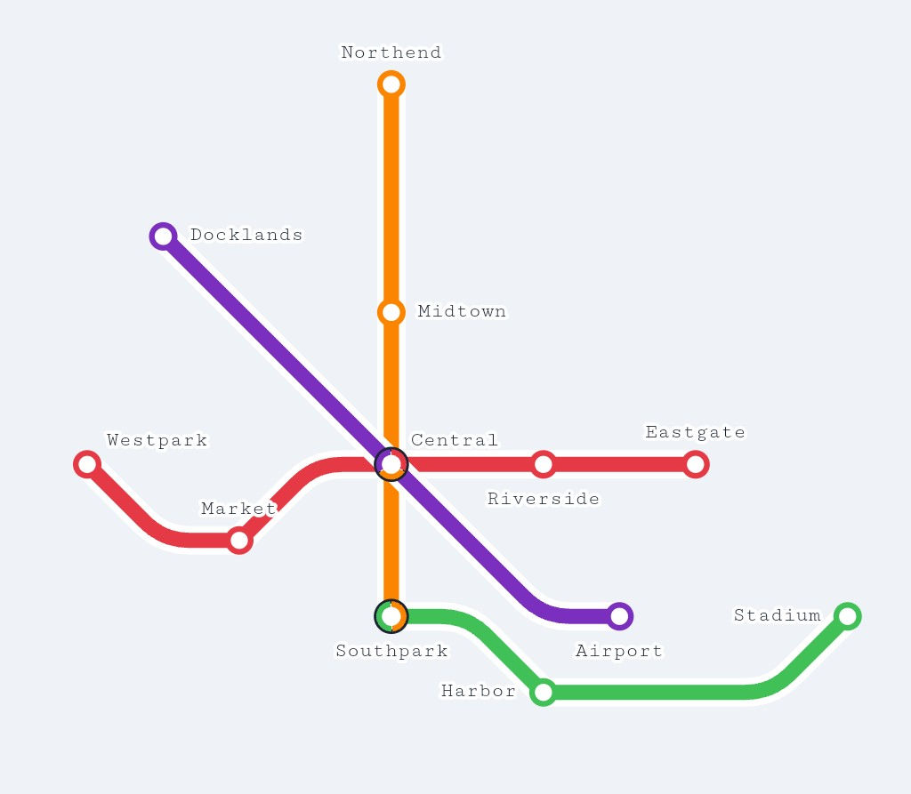

<div align="center">


# Metro Creator

**A clean, browser-based metro map editor. No backend, no dependencies, no account required.**

[](LICENSE)
[](https://developer.mozilla.org/en-US/docs/Web/JavaScript)
[]()



</div>

---

## Features

- **Draw lines** with diagonal, orthogonal, or direct routing
- **Place stations** snapped to a grid — drag to reposition
- **Transfer stations** auto-render colored arcs for each line
- **Loop lines** — close a route by clicking the first station
- **Label control** — 8-direction label placement per station
- **Legend** — toggleable overlay showing lines and stop counts
- **Undo / Redo** — full history (60 steps)
- **Export** — PNG (2× retina) and SVG
- **Auto-save** — persists to localStorage every 10 seconds
- **No install** — pure HTML + CSS + JS, open in any browser

---

## Getting Started

```bash
git clone https://github.com/znatgost/MetroMapCreator.git
cd MetroMapCreator
# Open index.html in your browser — that's it.
```

Or just drop `index.html` in any static host (GitHub Pages, Netlify, etc.).

---

## File Structure

```
metro-creator/
├── index.html       # App shell & markup
├── style.css        # All styles
├── favicon.svg      # App icon
└── js/
    ├── state.js     # Data model, history, coordinate helpers
    ├── router.js    # SVG path computation (diagonal / ortho / direct)
    ├── renderer.js  # SVG rendering (lines, stations, labels, UI layer)
    ├── editor.js    # Pointer, keyboard & context-menu interactions
    ├── ui.js        # Panels, toolbar, export, settings, legend
    └── app.js       # Boot, demo map, persistence
```

---

## Keyboard Shortcuts

| Key | Action |
|-----|--------|
| `S` | Select / Move tool |
| `A` | Station tool |
| `L` | Line tool |
| `X` | Delete tool |
| `N` | New line |
| `Esc` | Cancel / deselect |
| `Del` | Remove selected element |
| `Ctrl Z` | Undo |
| `Ctrl Y` | Redo |
| `Space` + drag | Pan canvas |
| `Scroll` | Zoom in / out |

---

## Settings

Click ⚙ in the header to toggle:

- Station label visibility
- Grid dot visibility
- Legend (line names, stop counts)
- Canvas background color

---

## License

```
MIT License

Copyright (c) 2026

Permission is hereby granted, free of charge, to any person obtaining a copy
of this software and associated documentation files (the "Software"), to deal
in the Software without restriction, including without limitation the rights
to use, copy, modify, merge, publish, distribute, sublicense, and/or sell
copies of the Software, and to permit persons to whom the Software is
furnished to do so, subject to the following conditions:

The above copyright notice and this permission notice shall be included in all
copies or substantial portions of the Software.

THE SOFTWARE IS PROVIDED "AS IS", WITHOUT WARRANTY OF ANY KIND, EXPRESS OR
IMPLIED, INCLUDING BUT NOT LIMITED TO THE WARRANTIES OF MERCHANTABILITY,
FITNESS FOR A PARTICULAR PURPOSE AND NONINFRINGEMENT. IN NO EVENT SHALL THE
AUTHORS OR COPYRIGHT HOLDERS BE LIABLE FOR ANY CLAIM, DAMAGES OR OTHER
LIABILITY, WHETHER IN AN ACTION OF CONTRACT, TORT OR OTHERWISE, ARISING FROM,
OUT OF OR IN CONNECTION WITH THE SOFTWARE OR THE USE OR OTHER DEALINGS IN THE
SOFTWARE.
```
